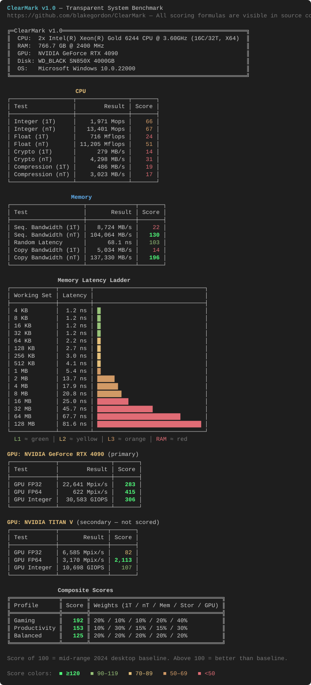

# ClearMark

**Transparent System Benchmark for Windows**

ClearMark measures CPU, memory, storage, and GPU performance with every scoring formula visible in source code. No black boxes, no hidden weights — just honest numbers you can audit and verify.

## Quick Start

```
ClearMark.exe
```

That's it. ClearMark detects your hardware and runs all benchmarks automatically. Results are printed as a formatted report with scores relative to a mid-range 2024 desktop baseline (score of 100).

### Options

| Flag | Effect |
|---|---|
| `--skip-storage` | Skip storage benchmarks (useful for quick runs) |
| `--skip-gpu` | Skip GPU benchmarks (useful if no DX12 GPU) |

## What It Measures

### CPU (8 tests)
| Test | What | 1T + nT |
|---|---|---|
| **Integer** | Sieve of Eratosthenes (ALU, branching, L2 cache), repeated ≥150 ms | ✓ |
| **Float** | 256×256 dense matrix multiply (FMA / cache) | ✓ |
| **Crypto** | SHA-256 hashing (hardware acceleration where available) | ✓ |
| **Compression** | Brotli Fastest **compress only** of incompressible random data | ✓ |

### Memory (5 tests)
| Test | What |
|---|---|
| **Seq. Bandwidth (1T)** | Pinned P-core sequential read + NT-store write (STREAM 2×) |
| **Seq. Bandwidth (nT)** | All-core, NUMA first-touch, pinned threads, separate read/write arrays |
| **Copy Bandwidth (1T)** | Pinned P-core AVX NT-store copy (STREAM 2×, same kernel as nT) |
| **Copy Bandwidth (nT)** | All-core AVX NT-store copy with processor-group pinning |
| **Random Latency** | Single-cycle pointer-chase (one node per cache line) at `max(4× L3, 128 MB)` |

Plus a **latency ladder** from 4 KB through that same RAM working set. Bars are colored from detected L1/L2/L3 sizes.

### Storage (4 tests)
| Test | What |
|---|---|
| **Seq. Read / Write** | 4 GB unbuffered sequential I/O at **QD1** (`File.OpenHandle` + `FILE_FLAG_NO_BUFFERING`) |
| **4K Random Read / Write** | 4 KB random I/O at **QD1** |

QD1 unbuffered I/O is the intended test (desktop snappiness, not a queued saturation run). The **host** can cap the drive well below its marketing peak — CPU, chipset, and PCIe generation/lane count included. CrystalDiskMark QD32 numbers on a different bus are not a target.

### GPU (3 tests per device)
| Test | What |
|---|---|
| **FP32** | 4K×4K Mandelbrot (single precision) |
| **FP64** | 4K×4K Mandelbrot (double precision, if supported) |
| **Integer** | 16M-thread xorshift-multiply hash chain |

All GPUs with hardware DX12 support are benchmarked. Only the DXGI primary (display) GPU contributes to composite scores. FP64 is shown in the GPU table but is **not** part of the Gaming composite. Each GPU sample is one fat dispatch (~1 s of shader work, repeats inside the kernel) so launch/sync is not the thing being timed.

## Composite Scores

Three weighted profiles combine all category scores:

| Profile | CPU 1T | CPU nT | Memory | Storage | GPU | Use Case |
|---|---|---|---|---|---|---|
| **Gaming** | 20% | 10% | 10% | 20% | 40% | Frame rates, game loading |
| **Productivity** | 10% | 30% | 15% | 15% | 30% | Compilation, rendering, VMs |
| **Balanced** | 20% | 20% | 20% | 20% | 20% | General-purpose |

When storage or GPU is skipped (`--skip-storage` / `--skip-gpu`) or missing:

- **Gaming** — that category scores **0** (40% GPU cannot be inflated by skipping the GPU). FP64 is excluded from Gaming even when it ran.
- **Productivity** and **Balanced** — skipped-category weight is redistributed; FP64 is included in the GPU average.

## Sample Output

Scores are color-coded in the terminal: 🟢 **green** (≥ 90) · 🟡 **yellow** (70–89) · 🟠 **orange** (50–69) · 🔴 **red** (< 50). A score of **100 = mid-range 2024 desktop baseline**. Bold green is ≥ 120.

This run is from the dual-Xeon Gold 6244 reference workstation (12-channel DDR4-2400, RTX 4090 + Titan V, SN850X on PCIe 3.0 x4):



<details>
<summary>Text version (for copy-paste)</summary>

```
ClearMark v1.1.3 — Transparent System Benchmark
https://github.com/blakegordon/ClearMark — All scoring formulas are visible in source code.

╔═ClearMark v1.1.3═════════════════════════════════════════════════════╗
║  CPU:  2x Intel(R) Xeon(R) Gold 6244 CPU @ 3.60GHz (16C/32T, X64)    ║
║  RAM:  766.7 GB @ 2400 MHz                                           ║
║  GPU:  NVIDIA GeForce RTX 4090           PCIe 3.0 x16  32.0.15.8180  ║
║  GPU:  NVIDIA TITAN V                    PCIe 3.0 x16  32.0.15.8180  ║
║  Disk: WD_BLACK SN850X 4000GB            PCIe 3.0 x4                 ║
║  OS:   Microsoft Windows 10.0.22000                                  ║
╚══════════════════════════════════════════════════════════════════════╝

                    CPU
┌──────────────────┬───────────────┬───────┐
│ Test             │        Result │ Score │
├──────────────────┼───────────────┼───────┤
│ Integer (1T)     │    2,163 Mops │    72 │
│ Integer (nT)     │   33,603 Mops │   168 │
│ Float (1T)       │    933 Mflops │    31 │
│ Float (nT)       │ 16,429 Mflops │    75 │
│ Crypto (1T)      │      277 MB/s │    14 │
│ Crypto (nT)      │    4,260 MB/s │    30 │
│ Compression (1T) │    1,037 MB/s │    41 │
│ Compression (nT) │   12,914 MB/s │    72 │
└──────────────────┴───────────────┴───────┘

                    Memory
┌─────────────────────┬──────────────┬───────┐
│ Test                │       Result │ Score │
├─────────────────────┼──────────────┼───────┤
│ Seq. Bandwidth (1T) │   8,504 MB/s │    21 │
│ Seq. Bandwidth (nT) │ 129,244 MB/s │   162 │
│ Random Latency      │      95.9 ns │    73 │
│ Copy Bandwidth (1T) │  10,401 MB/s │    15 │
│ Copy Bandwidth (nT) │ 153,197 MB/s │   219 │
└─────────────────────┴──────────────┴───────┘

                  Memory Latency Ladder
┌─────────────┬─────────┬────────────────────────────────┐
│ Working Set │ Latency │                                │
├─────────────┼─────────┼────────────────────────────────┤
│ 4 KB        │  1.4 ns │ █                              │
│ 8 KB        │  1.4 ns │ █                              │
│ 16 KB       │  1.4 ns │ █                              │
│ 32 KB       │  1.4 ns │ █                              │
│ 64 KB       │  3.5 ns │ █                              │
│ 128 KB      │  3.5 ns │ █                              │
│ 256 KB      │  3.5 ns │ █                              │
│ 512 KB      │  4.7 ns │ █                              │
│ 1 MB        │  5.8 ns │ █                              │
│ 2 MB        │ 22.4 ns │ ███████                        │
│ 4 MB        │ 22.4 ns │ ███████                        │
│ 8 MB        │ 23.2 ns │ ███████                        │
│ 16 MB       │ 27.9 ns │ █████████                      │
│ 32 MB       │ 62.2 ns │ ████████████████████           │
│ 64 MB       │ 84.5 ns │ ████████████████████████████   │
│ 128 MB      │ 90.0 ns │ ██████████████████████████████ │
└─────────────┴─────────┴────────────────────────────────┘
  L1 │ L2 │ L3 │ RAM

               Storage
┌───────────────┬────────────┬───────┐
│ Test          │     Result │ Score │
├───────────────┼────────────┼───────┤
│ Seq. Write    │ 2,384 MB/s │    60 │
│ Seq. Read     │ 2,417 MB/s │    48 │
│ 4K Rand Write │   191 MB/s │    96 │
│ 4K Rand Read  │    62 MB/s │    78 │
└───────────────┴────────────┴───────┘

GPU: NVIDIA GeForce RTX 4090 (primary)
┌─────────────┬───────────────┬───────┐
│ Test        │        Result │ Score │
├─────────────┼───────────────┼───────┤
│ GPU FP32    │ 27,367 Mpix/s │   342 │
│ GPU FP64    │    395 Mpix/s │   263 │
│ GPU Integer │  30,466 GIOPS │   305 │
└─────────────┴───────────────┴───────┘

GPU: NVIDIA TITAN V (secondary — not scored)
┌─────────────┬──────────────┬───────┐
│ Test        │       Result │ Score │
├─────────────┼──────────────┼───────┤
│ GPU FP32    │ 7,136 Mpix/s │    89 │
│ GPU FP64    │ 4,659 Mpix/s │ 3,106 │
│ GPU Integer │ 10,927 GIOPS │   109 │
└─────────────┴──────────────┴───────┘

                       Composite Scores
╔══════════════╦═══════╦══════════════════════════════════════╗
║ Profile      ║ Score ║ Weights (1T / nT / Mem / Stor / GPU) ║
╠══════════════╬═══════╬══════════════════════════════════════╣
║ Gaming       ║   170 ║ 20% / 10% / 10% / 20% / 40%          ║
║ Productivity ║   146 ║ 10% / 30% / 15% / 15% / 30%          ║
║ Balanced     ║   119 ║ 20% / 20% / 20% / 20% / 20%          ║
╚══════════════╩═══════╩══════════════════════════════════════╝

Score of 100 = mid-range 2024 desktop baseline. Above 100 = better than baseline.
Gaming: skipped storage/GPU score 0 (not redistributed); FP64 excluded. Productivity/Balanced redistribute skips and include FP64.
```

</details>

## Building from Source

Requires [.NET 10 SDK](https://dot.net) on Windows.

```bash
dotnet build --configuration Release
```

The compiled binary is at `bin/Release/net10.0-windows/ClearMark.exe`.

## Design Philosophy

- **Transparent** — Every baseline, weight, and formula is a readable constant in [`Scoring.cs`](Scoring.cs). No obfuscation.
- **Simple** — Each test is a short method you can read in a minute. Scoring is an enum + table, not string keys.
- **Honest** — Median of multiple iterations. No cherry-picking. Lower-is-better metrics (latency) are scored correctly.
- **NUMA-aware** — Multi-threaded memory tests use native memory allocation, first-touch page distribution, and thread pinning for accurate bandwidth measurement on multi-socket systems.

## Technical Details

- **GPU compute** via [ComputeSharp](https://github.com/Sergio0694/ComputeSharp) (DX12 compute shaders)
- **Storage I/O** via `File.OpenHandle` + `RandomAccess` with `FILE_FLAG_NO_BUFFERING` — bypasses OS cache; QD1
- **Memory bandwidth** via `NativeMemory.AlignedAlloc` + `SetThreadGroupAffinity` + AVX non-temporal stores
- **Console output** via [Spectre.Console](https://spectreconsole.net/) for rich table formatting

## License

[MIT](LICENSE)
